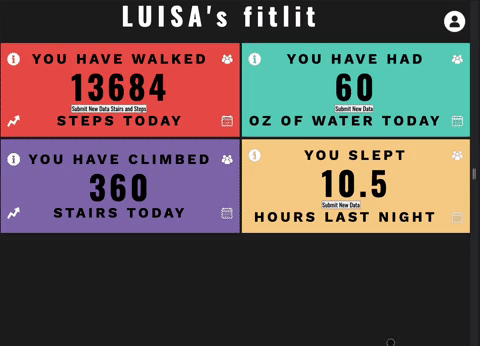
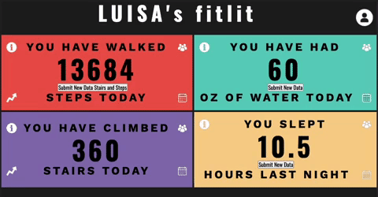

# Refactor Tractor - Fitlit (version A)

Fitlit is a dashboard that, for a user, presents their latest activity data, goals, and milestones.

The project spec can be found [here](https://frontend.turing.edu/projects/module-2/refactor-tractor.html).

The original project spec can be found [here](https://frontend.turing.edu/projects/fitlit.html).

## Install

1. Clone down the api server `git clone https://github.com/turingschool-examples/fitlit-api`
   1. This API holds the data our project will fetch in order to populate the browser with info
2. CD into your local clone `cd fitlit-api`
3. Install project dependencies `npm install`
4. Run `npm start`
5. Clone down this repository `git clone https://github.com/tylrs/fitlit-optionA`
6. CD into your local clone `cd fitlit-optionA`
7. Install project dependencies `npm install`
8. Run `npm start` and open `localhost:8080` in your preferred browser

## Goals
* Build on top of pre-existing code that you did not write and navigate someone else’s codebase
* Make network requests to API endpoints to retrieve and manipulate data
* Refactor pre-existing code and use inheritance to DRY up repetitive logic
* Ensure your app is following best practices for accessibility
* Leverage Sass to DRY up your CSS

## Features

### Screenshot showing responsive app

### Screenshot showing post working for steps

### Screenshot showing post not working for steps

### Screenshot showing post working for hydration

### Screenshot showing post working for sleep

## Contributors

This application was written by [Ash O'Brien](https://github.com/AshleyOh-bit), [Taylor Galloway](https://github.com/tylrs), and [Alex Kio](https://github.com/alexmkio); Mod 2 frontend engineering students at [Turing School of Software & Design](https://turing.edu/).

## Technologies Used

This application uses vanilla JavaScript, HTML, and SCSS. Mocha and Chai are used as the testing suite. Webpack is used to bundle the javascript and as the SASS compiler. GitHub and Git are used for version control and collaboration. HTTP Request is being used to Get and Fetch data.

## Future Additions

We are unlikely to add any future functionality to this application, but here are some ideas for features that might improve it:
* Update methods that use find to use filter
* Separate methods into more classes
* Refactor all methods that use indexOf and divide by 7 instead of array.length
* Update styling and organization of how data is presented to the user